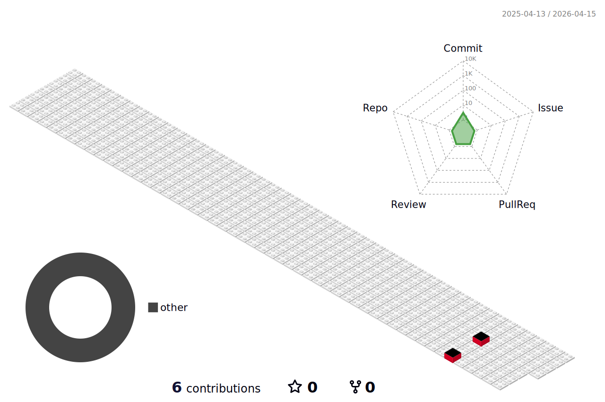

## <h1> Hello Fellow < Developers/ >!  </h1>

Hello My name is Sijil, and I'm passionate about software development. I love working with Python and Go, and I'm always eager to explore new technologies and tools. Whether it's building scalable applications with Amazon DynamoDB or ensuring data integrity with PostgreSQL, I'm here to create impactful solutions. I'm open to collaborating on interesting projects and contributing to open-source initiatives. Feel free to reach out!

## Technologies & Languages 

## 🧰 Tools

I frequently work with:

## Contact Me 

Feel free to contact me

## 📈 GitHub Stats

<!--START_SECTION:waka-->

<!--END_SECTION:waka-->

